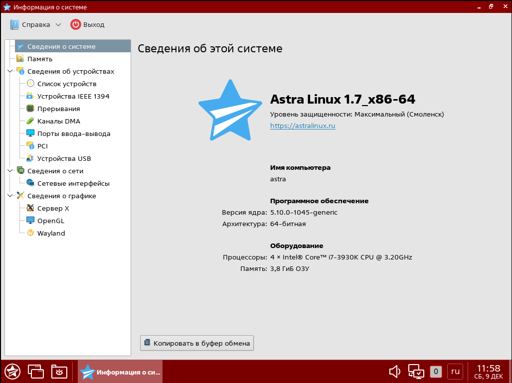
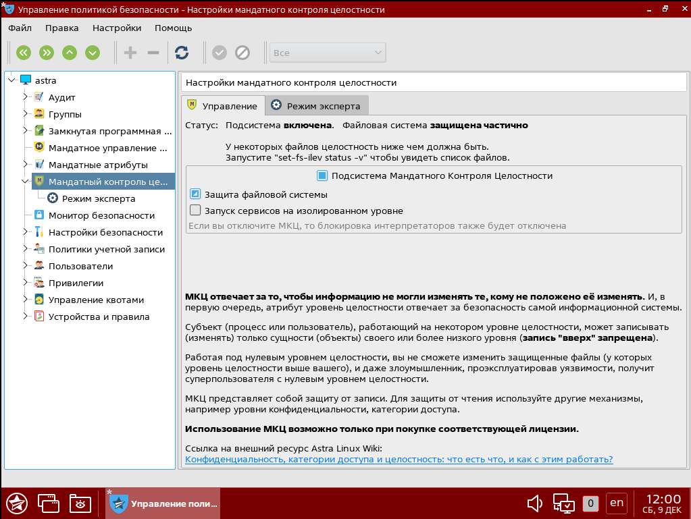
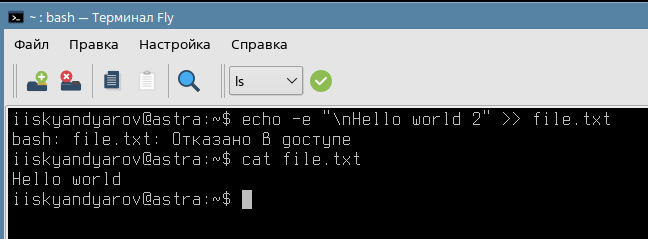
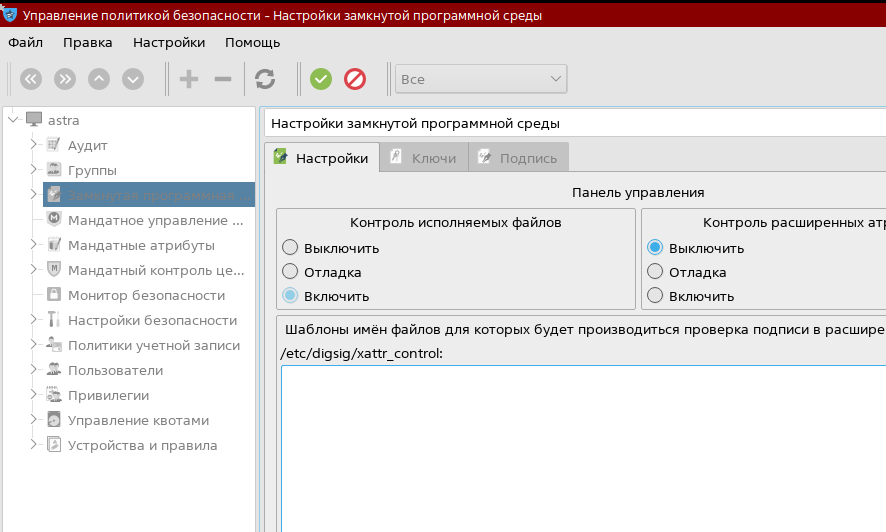
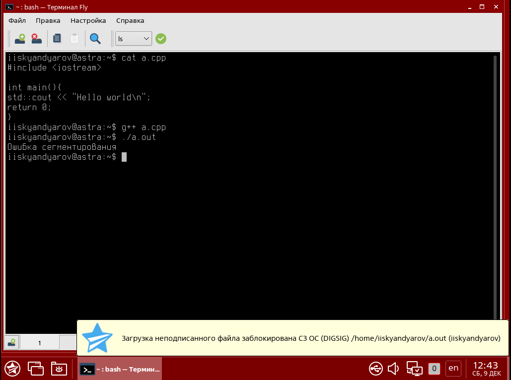
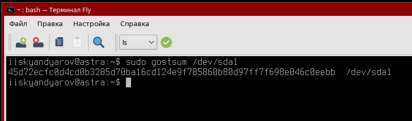
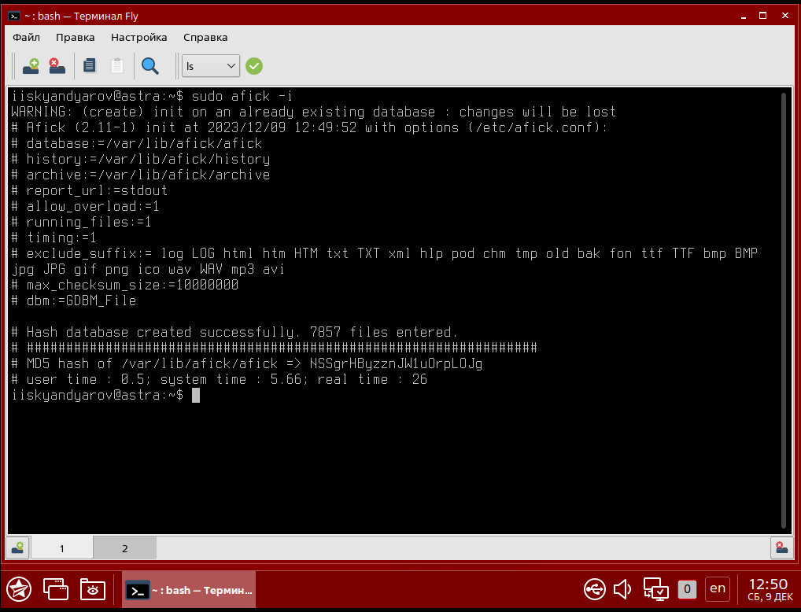
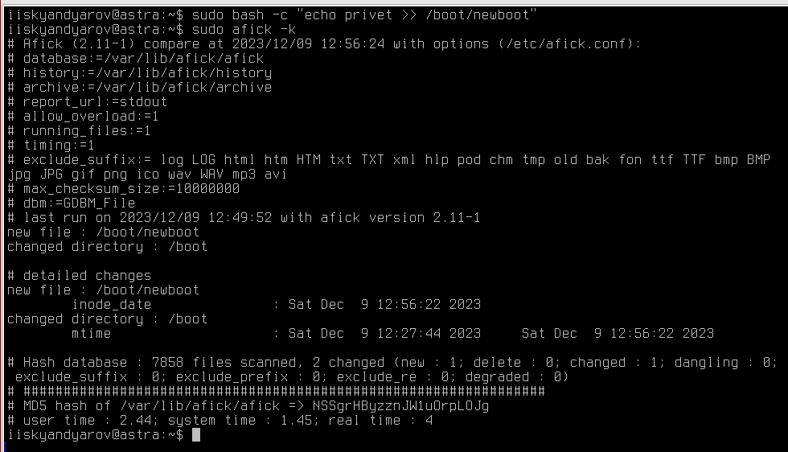

# Практическая работа №4.2. Контроль целостности

## Сведения об установленной системе

## Включение МКЦ

## Проверка запрета на запись вверх (NWU)

## Настройка ЗПС

## Компиляция ELF программы, тестирование запуска неподписанного файла

## Подсчет контрольной суммы раздела диска утилитой gostsum

## Инициализация afick

## Отслеживание изменений в ФС 
